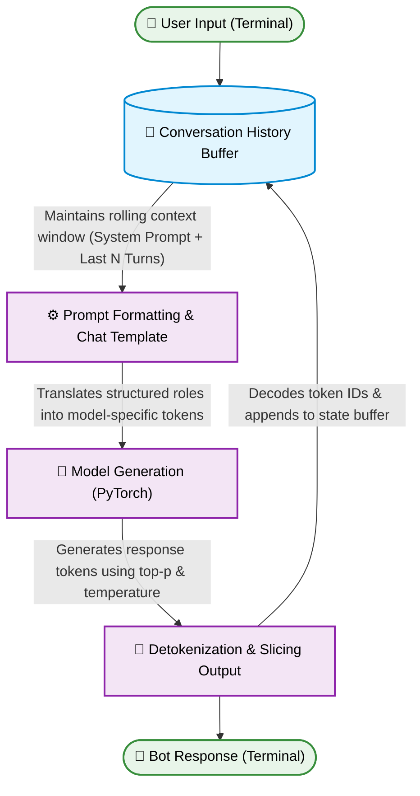
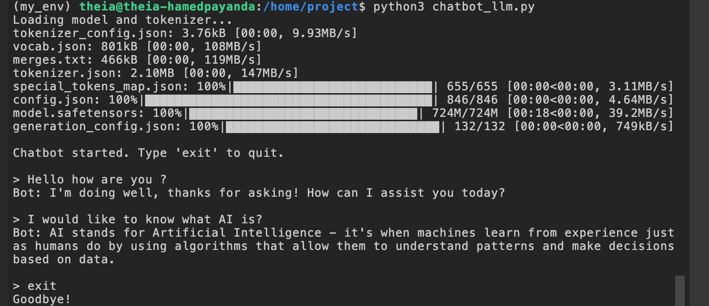

<div align="center">

# 🤖 Open Source LLM Chatbot

A professional-tier implementation of conversational AI agents using open-source Large Language Models (LLMs) and Hugging Face Transformers.

[](https://www.python.org/)
[](https://pytorch.org/)
[](https://huggingface.co/)
[](#)
[](https://cognitiveclass.ai/)
[](#)

</div>

---

## 📌 Project Overview

This repository demonstrates the evolution of chatbot architectures: transitioning from traditional sequence-to-sequence (Seq2Seq) model implementations to modern causal LLMs utilizing structured chat templates.

It contains two complete conversational AI implementations built with Python and PyTorch:

* **Legacy Seq2Seq Engine (`chatbot.py`):** Uses Facebook's `blenderbot-400M-distill`. Highlights foundational NLP principles including manual prompt formatting, tokenization, sequence-to-sequence generation, detokenization, and state-managed context retention.
* **Modern Causal LLM Engine (`chatbot_llm.py`):** Uses Hugging Face's instruction-tuned `SmolLM2-360M-Instruct`. Implements state-of-the-art Hugging Face Chat Templates (`apply_chat_template`), role-based messaging (system, user, assistant), and memory-efficient inference execution (`torch.inference_mode`).

---

## 🏗️ Architecture Flow Diagram



---

## ✨ Key Features

* **Dual Architecture Paradigms**: Demonstrates hands-on knowledge of both Seq2Seq and modern Causal/Decoder-only transformer architectures.
* **Hugging Face Chat Templates**: Utilizes standardized formatting (`apply_chat_template`) to manage multi-turn role interactions seamlessly. 
* **Rolling Context Management**: Features automatic window trimming to maintain context within maximum token limits without overflowing model memory.
* **CPU-Optimized Inference**: Implements `torch.inference_mode()` with lightweight model variants for rapid execution without needing high-end GPU resources. 
* **Hyperparameter Tuning**: Fine-tuned output generation settings including `temperature`, `top_p`, `repetition_penalty`, and `no_repeat_ngram_size` to control creative variance and minimize repetitive text loops.

---

## 🛠️ Core Tech Stack

| Technology | Purpose | Version |
| :--- | :--- | :--- |
| **Python** | Primary Programming Language | `3.10+` |
| **Hugging Face Transformers** | Model Architecture & Tokenizer Interfaces | `4.41.2` |
| **PyTorch** | Deep Learning Framework & Tensor Processing | `2.2.2` |
| **Accelerate** | Efficient Model Loading & Execution | `0.30.1` |
| **NumPy** | High-Performance Array Operations | `1.26.4` |

---

## 📁 Repository Structure
```text
open-source-llm-chatbot/
├── .theia/
│   └── settings.json          # IDE workspace configurations
├── .gitignore                 # Specifies intentionally untracked virtual environments
├── requirements.txt           # Pinned dependencies for reproducible execution
├── chatbot.py                 # Implementation 1: Seq2Seq BlenderBot Model
├── chatbot_llm.py             # Implementation 2: Modern Causal SmolLM2 Chat Engine
└── README.md                  # Detailed project documentation
```
---

# 🚀 Local Setup & Execution

### Prerequisites
* Python 3.10 or higher installed.
* `git` CLI tool configured on your machine.

1. Clone the Repository
```bash
git clone [https://github.com/HAMED-PAYANDA/open-source-llm-chatbot.git](https://github.com/HAMED-PAYANDA/open-source-llm-chatbot.git)
cd open-source-llm-chatbot
```
2. Create and Activate Virtual Environment
# Install virtualenv package if needed
```bash
pip3 install virtualenv

# Create environment
virtualenv my_env

# Activate environment
# On Linux/macOS:
source my_env/bin/activate
# On Windows Command Prompt:
# my_env\Scripts\activate.bat
```

3. Install Dependencies
```bash
pip install -r requirements.txt
```

4. Running the Chatbots
You can choose to run either implementation. To terminate either session, type exit at the command prompt.
Option A: Run the Modern Causal LLM Engine (Recommended)
```bash
python3 chatbot_llm.py
```


Option B: Run the Legacy Seq2Seq Engine
```bash
python3 chatbot.py
```
---

## 📜 License

This project is licensed under the [MIT License](LICENSE) - see the LICENSE file for details.

---

## 👤 Author

**Hamed Payanda**
* **GitHub:** [@HAMED-PAYANDA](https://github.com/HAMED-PAYANDA)
* Completed as part of the **IBM AI Developer Program**.


